# Offline Spline Execution Architecture

```mermaid
flowchart LR
    A[Offline wire-motion simulation] --> B[Dense XY points per mover]
    B --> C[Python cleanup + RDP reduction]
    C --> D[Arc-length resampling]
    D --> E[Deviation-bounded cubic B-spline smoothing]
    E --> F[Piecewise spline coefficients]
    E --> G[Raw-point / motion mapping]
    F --> H[ParametricSplineCoeff.csv]
    G --> H
    H --> I[TwinCAT CSV import]
    I --> J[PLC spline parameter store]
    J --> K[Segment time allocation]
    K --> L[Cyclic spline evaluation]
    L --> M[Next XY setpoint each PLC cycle]
    M --> N[External setpoint / XPlanar execution]
    N --> O[Progress, step-size and completion supervision]
```

## Offline preprocessing sequence

1. Offline simulation produces dense X/Y samples for each mover.
2. Repeated points are removed and RDP simplification reduces the geometric representation.
3. The path is parameterized by normalized cumulative arc length and resampled.
4. A cubic parametric B-spline is fitted.
5. Smoothing is adapted until the configured maximum deviation from the original trajectory is satisfied.
6. The spline is converted to piecewise cubic coefficients `A + B·u + C·u² + D·u³` for X and Y.
7. Original simulation samples are mapped back to the smoothed path so each spline segment retains information about the original motion progression.
8. Segment geometry and normalized timing information are exported to CSV.

## PLC runtime sequence

1. TwinCAT imports the spline-segment CSV into PLC-side storage.
2. The requested total motion time and per-segment weighting determine the segment time allocation.
3. Segment time and PLC point-generation cycle determine how many cyclic interpolation points are generated for the active segment.
4. On every point-generation cycle, the normalized spline parameter `u` advances within the active segment.
5. The PLC evaluates the cubic X/Y equations and generates the next external setpoint.
6. Segment counters advance until each mover reaches the end of its path.
7. Runtime checks supervise progress, maximum step size and completion.

## Why this architecture matters

The computationally heavier geometry processing is performed offline, while the machine-side task remains compact and deterministic. TwinCAT does not need to store or replay the full dense simulation trajectory; it only imports spline coefficients and metadata and evaluates the next point cyclically.

The reviewed implementation contains **1 ms point-generation logic**. The public material excludes machine identifiers, vendor/compiled libraries, native TwinCAT project files, safety configuration and raw simulation data.
