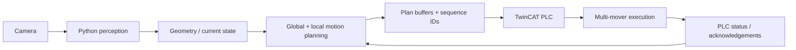

# Online Python / Vision / TwinCAT Architecture

## Responsibility split

### Python side

- camera acquisition and perception
- geometry extraction / current-state estimation
- global waypoint generation
- local collision-avoidance corrections
- sequence-numbered plan and override messages

### TwinCAT side

- deterministic machine execution
- command / acknowledgement handshake
- active plan buffering
- per-mover waypoint execution
- local-override execution with priority over global motion
- runtime state-machine supervision
- completion / fault feedback
- trace and diagnostic state

## Communication pattern

The reviewed implementation uses sequence IDs so that a new global plan or local override is accepted only once. TwinCAT copies incoming data into an active PLC-side buffer, acknowledges the accepted sequence, executes the motion and reports completion back to Python.

This separates online perception/planning from deterministic PLC-side motion execution while keeping the two sides synchronized.

## Publication scope

The native TwinCAT workspace is intentionally excluded. The public portfolio contains only sanitized architecture and source excerpts; real target-system network data, AMS identifiers, TwinSAFE configuration, licenses and vendor libraries remain private.
